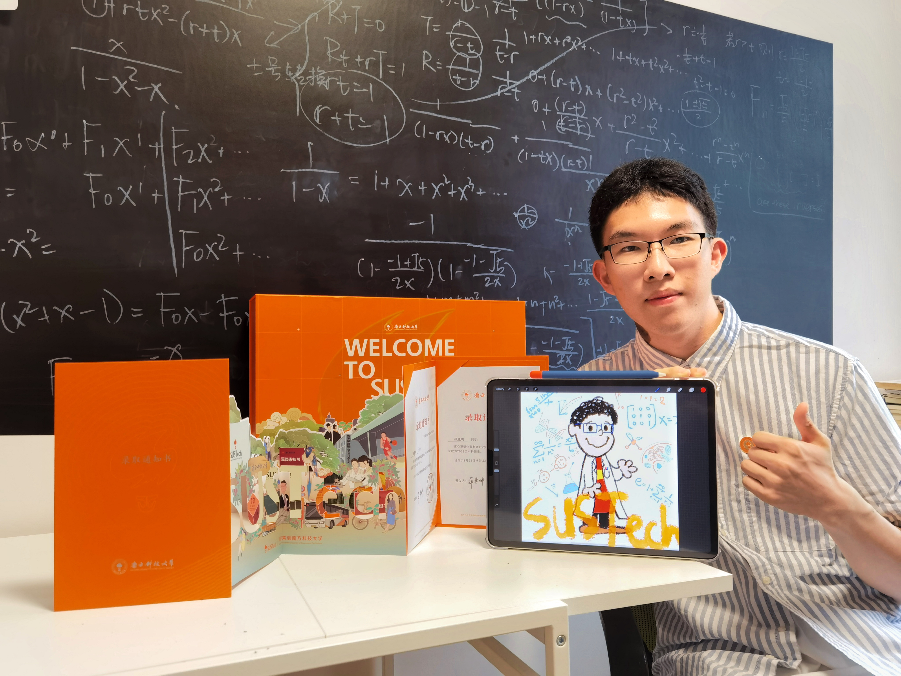

#  About Me

 My name is Lumi, which comes from my Chinese name Zhang Luming. I am from Guangzhou, China. 

## Studying Experiences

I am a undegraduate majoring in bioinformatics in [SUSTech](https://sustech.edu.cn), I am also very proud to be a member of Shuren College. My school is very beautiful and the teachers here are very nice. I enjoy learning in such a wonderful school! 

<!--  -->

## Hobbies
I consider myself as a very funny person and my hobbies change very quickly. But learning is something I always like and I'm always eager to learn more. That's why you will find a lot of learning related posts in my blog.

 My other hobbies include
*  🤺 Fencing
*  💻 Trying all sorts of things involving Computers
*  🎮 Playing games
*  📖 Reading all kinds of books
*  🍕 Eating delicious food
*  🎬 Watching movies

 AND a lot more!