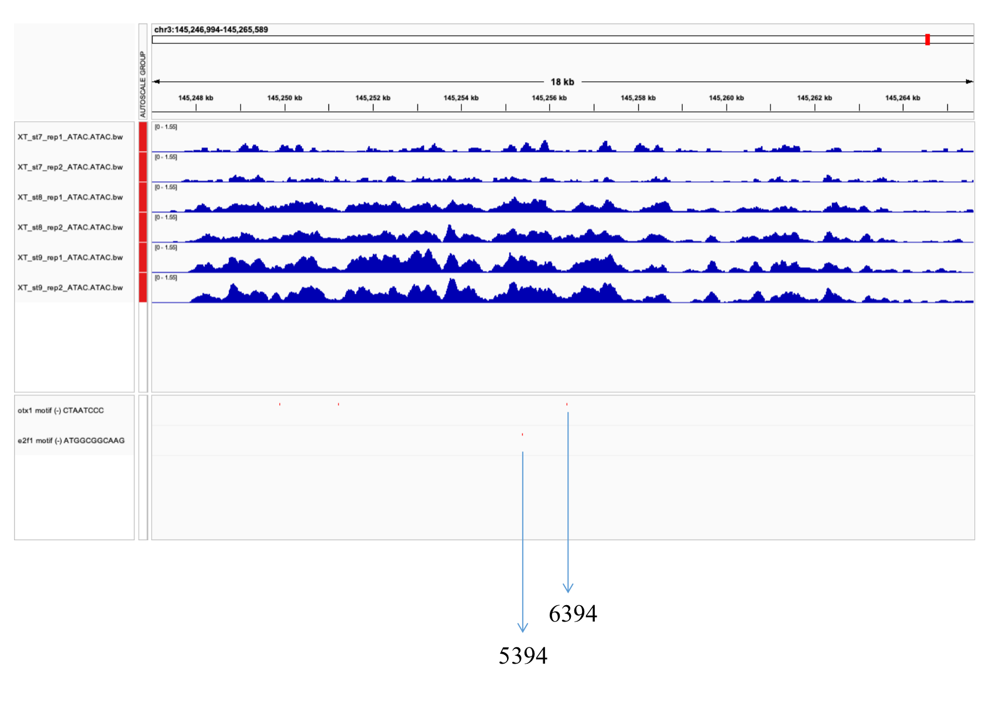

## <span style="font-family: Courier"> Motif analysis
<span style="font-family: Courier"> September 23rd, got my first ever project from Prof.Chen Wei. The first important step should be motif analysis. (my actual work-list is [here](https://bottlenose-stilton-cc3.notion.site/Co-occurrence-for-Luming-108a4aac2b2844bcb0b40961d8bffa6f))

<span style="font-family: Courier"> To summarize, finding the linkage between two TF proteins which regulates gene expression is what we should do. By finding the linkage between the motifs of proteins in the promoter zone of the gene, we can hypothesis that some of the proteins have interactions with each other.

### <span style="font-family: Courier"> Pipelines

#### <span style="font-family: Courier"> Preparing raw materials
<span style="font-family: Courier"> Time: October 2nd
<span style="font-family: Courier"> Several raw materials are needed for this analysis. Including:
- <span style="font-family: Courier"> The motif files of the TF proteins we are interested in.
- <span style="font-family: Courier"> Classify the ATAC-seq peaks and filter the non-promoter ones.
- <span style="font-family: Courier"> Getting the sequence for the filtered peaks.

<span style="font-family: Courier"> The motif files of the TF proteins are fairly easy to obtain. Go to [JASPR database](https://jaspar.genereg.net) and download the motifs you need. You can download multiple motifs in one text file by adding them to the cart.

<span style="font-family: Courier"> Classifying the ATAC-seq files need some Linux skills (which sadly I don't have) and we also need [Homer](http://homer.ucsd.edu/homer/). First, we have to classify our own unique genome. Because we are using frogs, which are not very common, Homer requires us to build our own reference genome, which can be easily done following the guidelines [here](http://homer.ucsd.edu/homer/introduction/update.html). This procedure requires the FASTA file for the genome and the gtf file for the genome annotation.

```bash
loadGenome.pl -name XenTr10 -fasta Xentr10.repeatMasked.fasta -gtf Xentr10.0.gene.chr.gtf -org xenopus
```

<span style="font-family: Courier"> After loading our own genome into Homer, we can classify the peaks we get from our normal ATAC-seq pipeline.

```bash
annotatePeaks.pl st9-2_peaks.narrowPeak XenTr10 > st9-2-annotated.txt
```


<span style="font-family: Courier"> Within the text file, there are peaks that are classified as intron, intergenic, promoter etc. We need to filter out the ones containing promoters. So this is where the powerful [awk](https://www.geeksforgeeks.org/awk-command-unixlinux-examples/) comes.
```bash
awk '/promoter/ {print}'  st9-2-annotated.txt > st9-2-promoter.txt
```
<span style="font-family: Courier"> This simple command can filter out all the lines containing promoter into a new file. We also need to convert the new text file into bed format by cutting out some of the important lines (you can use awk for this as well).
```bash
cut -f 2,3,4,16 XXX.txt >XXX.bed
```
<span style="font-family: Courier"> Thus we can get a bed format file that contains only the promoter peaks from the ATAC-seq peaks.

<span style="font-family: Courier"> At last, we get our filtered peaks and map them back to the genome, thus obtaining their sequence. Using **[bedtools](https://bedtools.readthedocs.io/en/latest/content/tools/getfasta.html)** we can finish these steps very quickly. 
```bash
bedtools getfasta -fi Xentr10.repeatMasked.fasta -bed xxx.bed -fo output.fa -name
```

#### <span style="font-family: Courier"> Finding the motifs
<span style="font-family: Courier"> After we got our wanted sequence of all the promoters of the ATAC-seq peaks, we would like to see where are the motifs of the two TF proteins located, if at all, in these promoter sequences. Do they really activate the gene expression? Or that they are not bound to these sites. We use [fimo](https://meme-suite.org/meme/doc/fimo.html) from [meme](https://meme-suite.org/meme/) to match the motifs with our sequence.
```bash
fimo --o dir/fimo OTX1.meme st9-2-promoter-gene.fa
```
<span style="font-family: Courier"> Thus you get all the matches of the motif and your peaks.

### <span style="font-family: Courier"> Polishing the R program

<span style="font-family: Courier">  Time: October 3rd and 4th

<span style="font-family: Courier"> After we find the motifs of E2F1 and OTX1 and their location in our genome, we can see their length and location. By finding correlation between their position and distance, we might discover patterns. 

#### <span style="font-family: Courier"> Relationship between E2F1 and OTX1

<span style="font-family: Courier"> E2F1 and OTX1 motif might exist in the same part of the chromosome (in the same peak), we would like to take these part out and find the relationship between the two motifs, whether one motif is usually in the upstream of the other, the general distance between the two motifs etc. **I will see tomorrow if I can remember to upload the codes onto GitHub, but actually I should.**

<span style="font-family: Courier"> After fiddling with the parameters (mainly just changing the binSize variable in the function lapply), we found out that, out of 1518 co-occurrence of E2F1 and OTX1, 30 of them have very similar distance between them. Roughly 1000bp between the two motifs (E2F1 motif are to the upstream of OTX1). These motifs with strange distance between them are found on chormosome 3, just in front of a set of different genes involved in t-RNA formation.

<span style="font-family: Courier"> These interesting little sets of motifs are later investigated by me. Because I was only using two stage-9 ATAC-seq data, I cannot be 100% sure that these motifs are only there because of pure chance or technical error during ATAC-seq.

<span style="font-family: Courier"> After examining stage8 and stage7 ATAC-seq data, I found the same pattern in stage8, but not in stage7. Stage8 ATAC peaks still have overlaps with the motifs on chr3, but in stage7, only E2F1 motifs can be found in the peaks of chr3. This might suggest that the OTX1 protein have something to do with the activation of transcription, or that E2F1 have something to do with t-RNA. I just don't know yet and we might need to look further into this with more data. ChIP-Seq data shows that in stage9, E2F1 and OTX1 proteins really did bind to the chromatin, and a 1000bp apart motif pair can be found from the data, but I didn't have the ChIP-seq data, and I still need time to get access to QiMing, this might not be finished so soon.

### <span style="font-family: Courier"> Technical Issue Found with Promoter Definition

<span style="font-family: Courier"> The nature of the 1000bp apart motif are identified by me after preparing for the PPT for the small talk next week. I'm both sad and happy about this. Sad because it is not something very beautiful, instead it was a glitch in our definition of the promoter. But I am also happy that I discovered this glitch early into this project, and understanding the nature of it will save us a lot of time in the future.



<span style="font-family: Courier"> While I was making the ppt, I discovered that, actually, the interesting 1000bp apart motifs in our ChIP-Seq data are actually the same one. They are read three times due to out definition of the promoter. Which is just taking the taking 2000bp upstream and downstream of the TSS of the gene. So when it comes to two genes whose TSS are close to each other, their promoters overlap and are counted repeatedly (in this case 3 times). Thus leading to multiple promoters containing the same set of motif, and multiple counts at a certain distance.

<span style="font-family: Courier"> Futher discussion with Prof.Chen and Dr.Cui are needed, and it's scheduled next week. I think I will give myself a break from work, and maybe spend some time on biochemistry and DSAA.