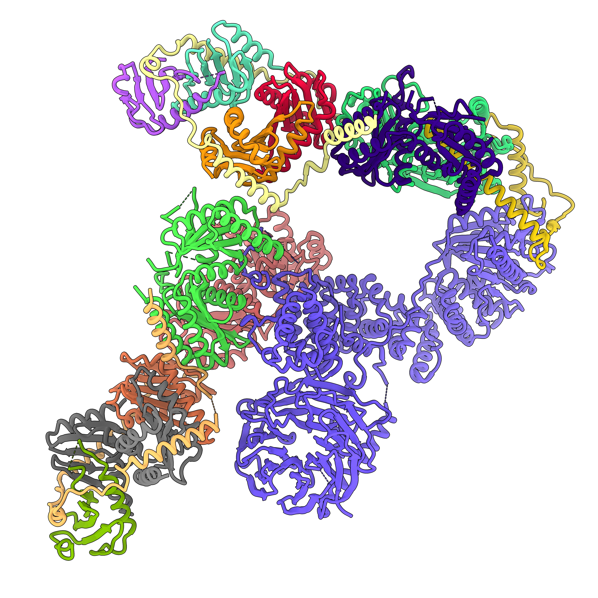
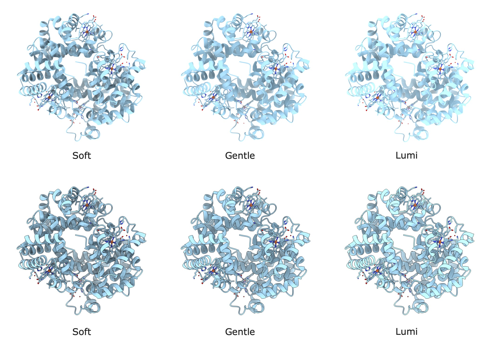
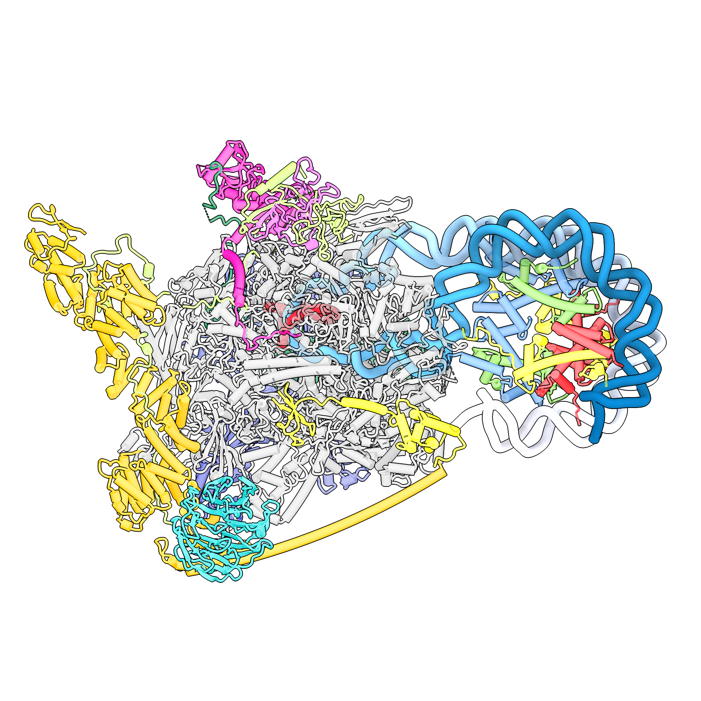

In this blog, I will describe some of the useful (and beautiful) visualization made with [ChimeraX](https://www.rbvi.ucsf.edu/chimerax/) I have found during the years of reading (and surfing the internet).

A useful [guide](https://rbvi.github.io/chimerax-recipes/) was made by the ChimeraX creators, and I tried to apply them to our protein of interest.

## Loopy Alpha Helix
I was listening to a talk by [Prof. James H. Hurley](https://membrane.berkeley.edu) in August at SUSTech, and I can't stop noticing how nice his resulting structures are. So I did some research and looked at his structures in this paper about the [lysosomal mTORC1–TFEB–Rag–Ragulator megacomplex](https://www.nature.com/articles/s41586-022-05652-7) published in nature, and mimicked his style. 


```python
windowsize 800 800 

open 7UX2
hide atoms 
show cartoons
color bychain

lighting soft msMapSize 64

cartoon style protein modeHelix default arrows false xsection oval width 1 thickness 1
cartoon style strand modeHelix default arrows true xsection rectangle width 2 thickness 1
cartoon style helix modeHelix default arrows false xsection oval width 1.6 thickness 1.2

graphics silhouettes width 3
graphics silhouettes true

save rag_ragulator.jpg pixelSize 0.05 quality 100
```


I prefer the thicker silhouette when viewing the whole protein. But I think it would be better if we can change the colour of the different chains. I will try to do that in the future.

**Update:**

A useful way to make the picture seem is simply to adjust the saturation of the picture with the `color modify` command. With this simple command:
```python
color modify saturation +70
```
We can make the picture more vivid and colourful.



However, I think some people might actually prefer the low-saturation one, but it's still good to learn that we can adjust this.

## Local Resolution Video

There is a wonderful [ChimeraX recipe](https://rbvi.github.io/chimerax-recipes/planes/planes.html) teaching us how to draw the grayscale planes of local resolution of a cryo-EM map. As [Prof. Liao](https://liao.bio.sustech.edu.cn/index.html?lang=en-us) mentioned in his class, local resolution is very important, and a good way to visualize this is by a density plane. So, here are the original codes in the recipe:


```python
windowsize 500 500
open 22910 from emdb
volume #1 style image level -0.4458,0 level 2.326,1 plane z,100
view orient
zoom 2
camera ortho
2dlabel text "plane number" xpos 0.8 ypos 0.1

movie record size 500,500
perframe "volume #1 plane z,$1 ; 2dlabel #2.1 text $1" range 100,300
wait 201
movie encode ~/Desktop/planes.mp4 quality high
```

<video width=500 height=500 controls>
  <source src="../chimera/sars_planes.mp4" type="video/mp4">
</video>

Now, applying this to our own RBD structure, it's similar. With codes:

```python
windowsize 800 800
set bgColor black
open ***/RBD_active.mrc

volume #1 level 0.35
surface dust #1 size 7

volume #1 style image level -0.4458,0 level 2.326,1 planes z,100
view orient
camera ortho
zoom 2
camera ortho
2dlabel text "plane number" xpos 0.8 ypos 0.1

movie record size 800, 800
perframe "volume #1 plane z,$1 ; 2dlabel #2.1 text $1" range 110,210
movie encode ~/Desktop/planes.mp4 quality high
```

<video width=500 height=500 controls>
  <source src="../chimera/rbd_planes.mp4" type="video/mp4">
</video>

A problem with this video is that this is not actually a top-side view of the density, making it hard to interpret. I think it might have something to do with the way the model is built? Or how CryoSPARC generate these electron density maps. I will try to see if we can set the plane to a wanted position in the future, a simple rest of the $x,y,z$ coordinates might do the trick.

## Very Good Lighting

ChimeraX's simple presets for lighting are sometimes not very satisfying. The preset `soft` introduces very weird shadows, and `gentle` sometimes seems not so lively. After some reading of the manuscript and fooling around, I made a new alias `lighting_lumi` for my lighting.
```
alias lighting_lumi lighting intensity 0.1 ambientIntensity 1.6 depthCue true multiShadow 64 msMapSize 128
```
In this code, the ambientIntensity is increased from 1.5 to 1.6 compared with `gentle`, and made the colour a bit more lively. `multiShadow` was set to 64, which removes the weird shadow problem with `soft` lighting, `msMapSize` was also changed for that.

Here is a comparison between the three lighting presets:


As we can see, the `lighting_lumi` command made the protein look more vivid, with higher exposure. Which I think looks better with silhouettes. It's a bit hard to say which one is better when we are not using silhouettes. Also, lighting conditions still might need to be adjusted according to specific characters due to their structure or the colour used.

## Using Color Palettes

ChimeraX supports colouring chains with palettes. In a [2022 paper about nucleosome retention](https://www.science.org/doi/10.1126/science.abo3851), the authors cleverly used this to indicate the position of the DNA chain.


This can be achieved with the following ChimeraX commands:

```python
rainbow Template target c palette ^PuBu-5
rainbow Non-template target c palette PuBu-5
```

The `^` in front of `PuBu-5` indicates using the palette in reverse order. The `Template` and `Non-template` are the names of the chains. Full codes can be found [here](./chimera/script-7unc.py), resulting in the following graph.

