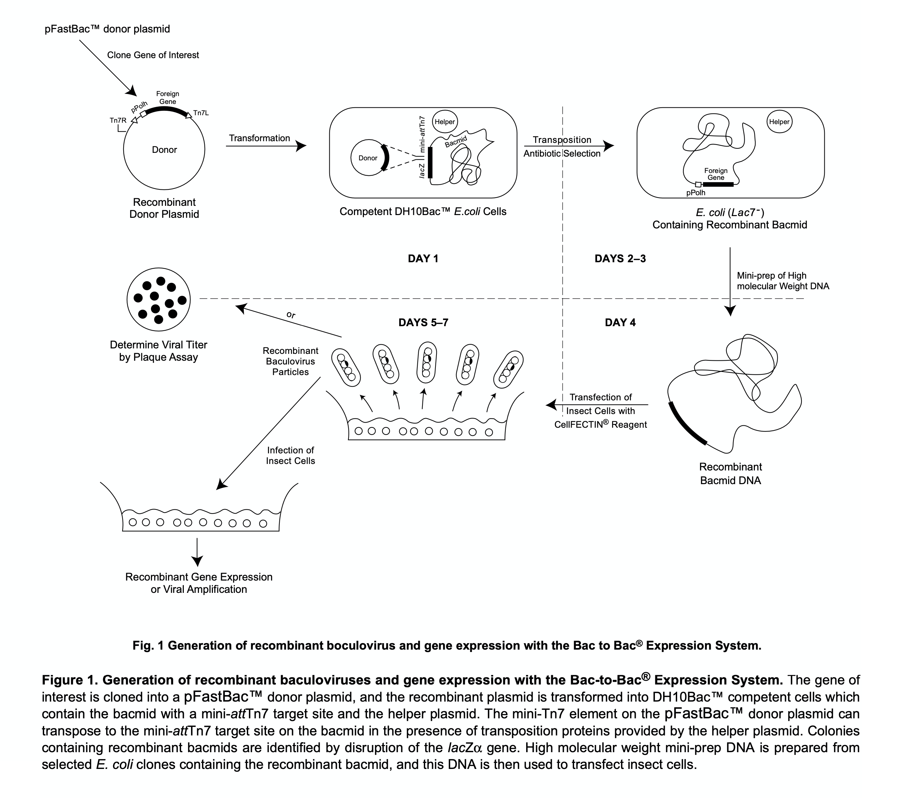
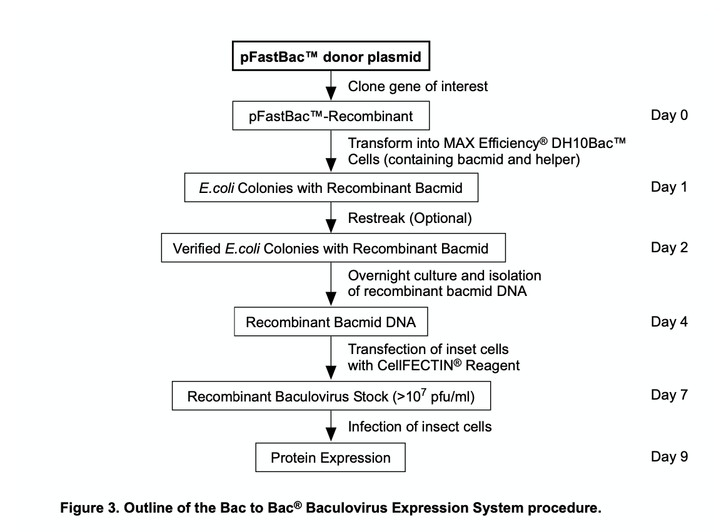

Purification of proteins with Sf9 cells is a process of repetition and experience. After working on this for a year, I would like to write it down if I need a reminder, or other people might find it useful. 

## Cell Culture
Cell cultures are better kept at $1.2 \times 10^6$ cells/mL, they grow best at the concentration.

### Thawing Frozen Sf9 Cells
1. Prepare a small frozen cell-culture vial.
1. Take out the frozen cell (normally 2 tubes at once) and store it in liquid nitrogen.
1. (Operating in fume cupboard) Prepare a 50mL tube with 40mL of pre-warmed culture medium.
1. (Fume cupboard) Prepare 25mL of culture medium inside the cell-culture vial.
1. Quickly thaw the frozen Sf9 cells in a 37°C water bath. Gently shake, but beware not to let the water touch the cap  to prevent contamination. Observe carefully when 50% are thawed, take out the cells after 80% are thawed.
1. Add the thawed cells to the 50mL tube with 2mL pipette.
1. Centrifuge the cells at 200g ($\leq$ 500g) for 5 minutes to enrich the cell and remove DMSO.
1. Remove the supernatant and resuspend the cells in 10mL of culture medium with pipette. Pipette around 20 times gently and avoid bubbles (maybe adjust the speed of pipette).
1. Add the resuspended cells to the 25mL culture medium in the vial. Beware of bubbles and mark the vial. Put it in the incubator at 27°C, 120RPM.
1. Observe the cells after 2-3 days, or when the concentration is $2-3 \times 10^6$ cells/mL. Do not subculture when the concentration is below $2 \times 10^6$ cells/mL. First two passages should have a higher concentration of $1.5 \times 10^6$ cells/mL.

## Bac-to-Bac Baculovirus Expression System

### Cloning into pFastBac Donor Plasmid

#### Amplification of gene fragments
1. Prepare a PCR reaction with the gene of interest and the primers.

    | Reagent | Volume($\mu$L)|
    |---|---|
    | ddH2O | 20 |
    | Template | 1 |
    | Primer F | 2 |
    | Primer R | 2 |
    | Enzyme (P525, 2x) | 25 |

1. Run the PCR reaction with the following conditions:

    - 95°C for 3 minutes
    - 95°C for 30 seconds
    - 55°C for 30 seconds
    - 72°C for $x$ minute (for gene of $x$kb)
    - Repeat steps 2-4 for 30 cycles
    - 72°C for 6 minutes
    - 4°C hold

    (In the mean time) 
    Gel preparation: 60mL of 1x TAE buffer, 0.6g of agarose, 1.5$\mu$L of GelRed. Heat in Microwave for 1min, and pour into the gel tray. Insert the comb and wait for ~40 minutes.

1. Run the PCR product on a 1% agarose gel to check the size of the product.
1. Purify the PCR product with a gel extraction kit.
1. Measure the concentration of the purified PCR product with a Nanodrop. A DNA concentration of ~100ng/$\mu$L is good.

Enzymes used in Lab:

- [P520](https://bio.vazyme.com/product/408.html): 2x Phanta Flash Master Mix, Vazyme.
- [P525](https://bio.vazyme.com/product/275.html): 2x Phanta Max Master Mix, Vazyme.

#### Cloning into pFastBac Donor Plasmid
1. Prepare a ligation reaction with the purified PCR product and the pFastBac donor plasmid.

    | Reagent | Amount |
    |---|---|
    | ddH2O | $x$ |
    | PCR Gene product | 100-200ng |
    | pFastBac Donor Plasmid | 50-100ng |
    | Ligase Enzyme (C115, 2x) | 5 $\mu$L |
    
    Add $x$ to the reaction to make the total volume 10$\mu$L.

1. Incubate the ligation reaction at 50°C for 20min (use the PCR instrument).
1. Transform the ligation reaction into DH5$\alpha$ cells.

    - Flaw DH5$\alpha$ cells on the ice for 6 minutes.
    - Add 5$\mu$L of the ligation reaction to the cells gently mix by shaking and incubate on ice for 30 minutes (open the 42&#176;C water bath).
    - Heat shock the cells at 42°C for 1 minute.
    - Rest on ice for 2 minutes, seed to LA culture (with Ampicillin 100$\mu$g/mL) and incubate at 37°C overnight.

1. Pick a single colony and culture in LA with Ampicillin. At the same time, send the cells for sequencing in 1mL of Amp+ LB medium.
1. Extract the plasmid from the colonies with the correct sequence with a plasmid extraction kit.

Enzymes used in Lab:

- [C115](https://bio.vazyme.com/product/83.html): 2x ClonExpress Mix, Vazyme.

#### Transposition of the Recombinant Donor Plasmid
1. Prepare Luria Agar plates containing:
    - 50$\mu$g/mL Kanamycin
    - 7$\mu$g/mL Gentamycin
    - 10$\mu$g/mL Tetracycline
    - 100$\mu$g/mL Bluo-gal
    - 40$\mu$g/mL IPTG
For Luria Agar plates:
        - 10g of Peptone 140
        - 5g of Yeast Extract
        - 10g of NaCl
        - 15g of Agar (LB goes without Agar)
        - 1L of ddH2O
    Add some NaOH to adjust the pH to 7.0, 0.5ml 10x NaOH in 1L LB medium.
    Autoclave and cool to 55°C, add the antibiotics and pour into the plates.
    
    When using the LB, remember to add the appropriate antibiotics. (e.g. 1mL 1000x ampicillin to 1L LB medium)

1. Thaw the DH10Bac cells on ice for approximately 6 minutes.
1. Add 250ng of the recombinant donor plasmid to the DH10Bac cells, mix gently, and incubate on ice for 30 minutes(Open the 42°C water bath).
1. Heat shock the cells at 42°C for 1 minute.
1. Rest on ice for 2 minutes, add 900$\mu$L of LB, incubate at 37°C, 220rpm for 4 hours.
1. Plate 10 $\mu$L of the cells on the Luria Agar plates with antibiotics and incubate at 37°C for 36-48 hours. Avoid light exposure by wrapping with Aluminum foil.

#### Isolation of Recombinant Bacmid DNA
Because the Bacmid DNA is a large plasmid (> 100 kb), we need different plasmid extraction method than the DH5$\alpha$ cells. The solutions are obtained from the Pure Plasmid Mini Kit (CWBio).

- Solution I: Solution P1.
- Solution II: Solution P2.
- Potassium acetate: Solution N3.

These are the required buffer for the reaction.

0. Put the isopropanol on ice or in freezer.
1. Select white colonies from the plate. Streak to fresh plates to verify the phenotype. Incubate overnight at 37°C.
1. Using a pick, inoculate a single colony into 2mL LB medium supplemented with 50$\mu$g/mL Kanamycin, 7$\mu$g/mL Gentamycin, and 10$\mu$g/mL Tetracycline in a 15ml snap-cap polypropylene tube. Incubate at 37°C, 220rpm up to 24h.
1. Transfer 1.5ml of culture to a 1.5ml microcentrifuge tube and centrifuge at 14,000 x g for 1 minute. Discard the supernatant with pipette, if needed briefly centrifuge again.
1. Resuspend (by vortexing or pipetting up and down) each pellet in 0.3ml of Solution I. Add 0.3ml of solution II, gently mix by reverting the tube for ~8 times. Incubate at room temperature for 3 minutes.
    Suspension should change from very turbid to almost translucent.
1. Slowly add 0.3ml of potassium acetate, mix by gently inverting the tube 8 times.
    A thick white precipitate of protein and _E.coli_ genomic DNA will form.
    Place the sample on ice for 10 minutes.
1. Centrifuge at 14,000 x g for 15 minutes. During the centrifugation, label another microcentrifuge tube and add 0.7ml absolute isopropanol to it.
1. Gently transfer the supernatant to the tube containing isopropanol. Avoid any white precipitate material. Mix by gently inverting the tube 8 times. Place on ice for 10 minutes.
    At this stage, the sample can be stored at -20°C overnight.
1. Centrifuge the sample for 15min at 14,000 x g. 
1. Discard the supernatant and wash the pellet with 0.5ml of 70% ethanol. Centrifuge for 5 minutes at 14,000 x g. Repeat this step again, and change the tube direction during centrifugation.
1. Use the pipette to remove as much supernatant as possible.
1. In the cabinet, Air-dry the pellet for 10 minutes. Dissolve the DNA in 40 $\mu$L of ddH2O or TE buffer. Allow the solution to sit in the tube with occasional gentle tapping. The DNA is generally dissolved and ready for use within 10min.
1. Store the DNA at -20°C. But avoid frequent freeze/thaw.

#### Harvest Recombinant Baculovirus Transfection of Sf9 Cells
1. Passaging the Sf9 cells to $0.8 \times 10^6$ cells/mL 3-4 hours previously. Usually 100mL of cells will suffice.
1. Add 10mL of sterilized PBS into a 15mL centrifuge tube.
1. Add 100$\mu$g of Bacmid DNA to the PBS and mix by gently inverting the tube for 15 times. 
1. Add 200$\mu$L of PEI (polyethylenimine) to the 15mL tube and mix by gently inverting the tube for 15 times.
1. Incubate the mixture at room temperature for 20-30 minutes.
1. Add the mixture into the 100mL of Sf9 cells and incubate for 5-6 days.
1. Add the supernatant to a 50mL tube and centrifuge at 500g for 5-10 minutes. Collect the supernatant, avoid light by wrapping with Aluminum foil, store at 4°C.
1. Add 5mL to 1L of Sf9 cells for protein expression, incubate for 2-3 days. Before cell collection, observe the fluorescence and viability (50-70%) of the cells under a microscope.

#### Cell Collection
1. Centrifuge the cells at 2190 rpm for 10-15 minutes.
1. Remove the supernatant and resuspend the cells in 30mL of PBS, move the cells to 50mL centrifuge tubes.
1. Centrifuge the cells for 1000g for 15 minutes.
1. Remove the supernatant and freeze the cells with liquid nitrogen. Store at -80°C.

#### Protein Purification
Based on the protein with His tag.

1. Thaw the cells and Cocktail in water at room temperature, meanwhile, prepare the buffer for protein purification with cold water. Book the centrifuge for 1.5h, at 20k rpm.
1. Add 2mL of Cocktail (protease inhibitor) per 100mL of cell into the lysis buffer.
1. Add lysis buffer of 2x volume of the cell pellet. Vortex the cells and incubate while inverting at 4°C for 1~1.5 hours.
1. Centrifuge the cells at 20k rpm for 1 hour at 4°C.
1. Pour the supernatant into a beaker and add 8mL beads to the supernatant. Incubate at 4°C for 2-3 hours while stirring (with a small swirl).
1. Centrifuge the beads at 1000g for 5 minutes at 4°C. Collect the supernatant into the beaker, and resuspend the beads and add the beads into the column.
1. Wash the beads with washing buffer for multiple times until the Bradford assay shows no protein in the wash.
1. (If want to remove Hsp70) Add 10mM ATP with Mg2+, incubate for 30 minutes at 4°C, wash with washing buffer.
1. Complex was concentrated with a 100kDa cut-off Amicon filter and further purified by size-exclusion chromatography. 
    Keep the protein at 4°C during the process!
    For protein concentration:

    - Wash the filter with ddH2O, centrifuge at 4000 rpm for 1 minute. Repeat 2 times.
    - Wash the filter with protein buffer, centrifuge at 4000 rpm for 1 minute. Repeat 2 times.
    - Add the protein to the filter and centrifuge at 4000 rpm for 2 minutes. Repeat multiple times till the final volume is 500$\mu$L to 1mL. Invert the tube every time before centrifugation.
    - During the previous centrifugation, prepare the 1.5mL filter tube. Wash the filter with ddH2O, centrifuge at 14000 xg for 1 minute. Repeat 2 times.
    - Wash the filter with protein buffer, centrifuge at 14000 xg for 1 minute. Repeat 2 times.
    - Add the protein to the filter and centrifuge at 14000 xg for 2 minutes. Repeat multiple times till the final volume is below 100$\mu$L or the concentration is above 15mg/mL. Invert the tube every time before centrifugation.
    - Invert the tube and place into a new centrifugal tube, centrifuge at 1000 xg for 2 minutes and collect the protein, measure the concentration.
    - Centrifuge at the largest velocity for 10 minutes to remove the bubbles, prepare the chromatography column.

    For the size-exclusion chromatography:

    - Wash the pump with ddH2O, and put the probe inside the washing buffer.
    - Turn the lamp on from manual control in the program.
    - Wash the pump. Stop after washing.
    - Perform the Equilibration method, and open the UV and autozero after equilibration.
    - Wash the needle with buffer. Discard the first 2 buffer and push the next 2 buffer into the column.
    - Load the sample and start the program. Keep column pressure under 1.7.
    - Put in the 96-well plate and collect the fractions.
    - After the run, put the pump into ddH2O. Run the washing method and turn off the lamp.
    
1. Peak fractions were pooled and examined with SDS-PAGE. The protein can be stored at -80°C.

    - During SDS-PAGE, the other side should be sealed with either a new gel, or an old one stuck reversely into the slot. So that the buffer will stay inside slot at all times.
    - The gel could be run at 180V for 45 minutes.
    - Stain with the gel staining machine.
    
1. Protein is concentrated to a good concentration for cryo-EM analysis.

Enzymes used in Lab:

- [Cocktail](https://www.medchemexpress.cn/inhibitor-kit/protease-inhibitor-cocktail.html): Protease Inhibitor Cocktail (EDTA-free, 100x in DMSO), MedChemExpress.