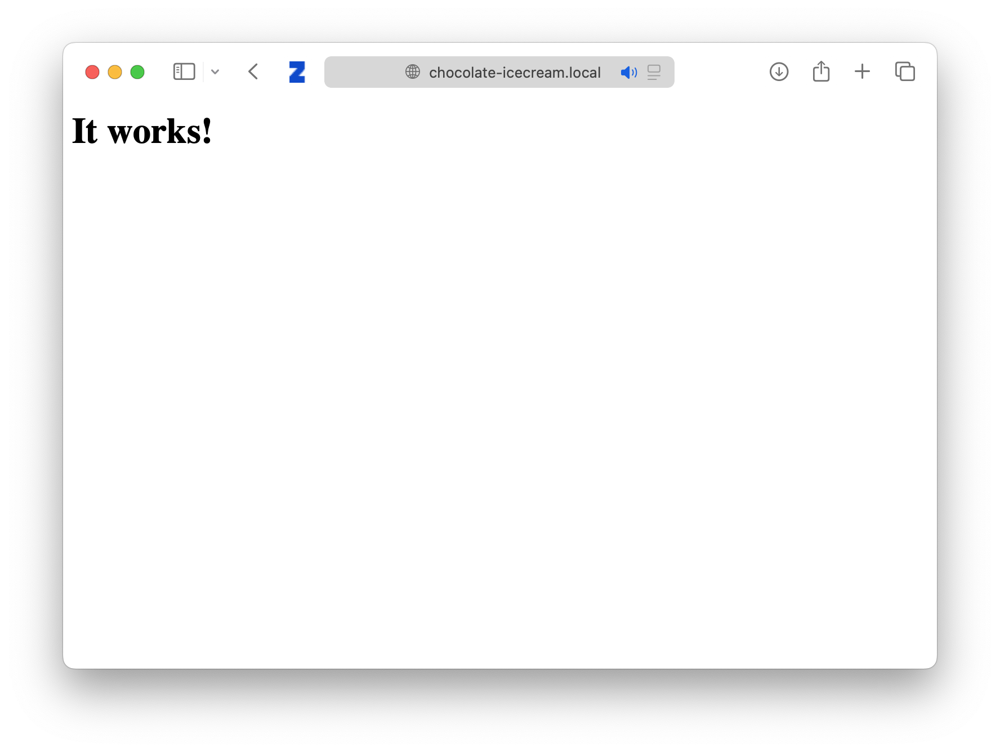
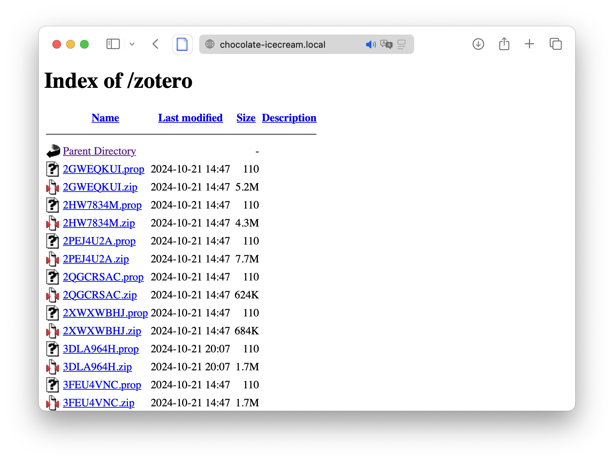

I'm trying to set-up a WebDAV server on my own MAC computer for my zotero synchronization.

Using the Apache Web Server on my Mac computer.

Start Apache:

```bash 
sudo apachectl start
```

Enable WebDAV functionality by modifying the configuration file.

```bash
sudo vim /etc/apache2/httpd.conf
```

And delete the `#` in front of the two following lines:

```bash
LoadModule dav_module libexec/apache2/mod_dav.so
LoadModule dav_fs_module libexec/apache2/mod_dav_fs.so
```

Then create a directory to store the files to be shared via WebDAV. Apache also requires access to the parent directory of the WebDAV directory.

```bash
mkdir /Users/~/zotero_webdav
sudo chown -R _www:_www /Users/~/zotero_webdav
sudo chmod -R 755 /Users/~/zotero_webdav
sudo chmod 755 /Users/~
```

Then add the following lines to the configuration file:

```bash
<Directory "/Users/lumizhang/zotero_webdav">
    Dav On
    AuthType Basic
    AuthName "WebDAV login"
    AuthUserFile /etc/apache2/users.password
    Require valid-user
</Directory>
```

Then create a password file:

```bash
sudo htpasswd -c /etc/apache2/users.password lumizhang
```

This password ensures only the ones with password can access the WebDAV directory.

Remember to add a lock database for Apache WebDAV implementation. This is done by adding the following line to the configuration file:

```bash
DAVLockDB "/Users/~/zotero_webdav/locks/DAVLockDB"
```

The lock database doesn't necessarily have to be in the webdav folder, but I put it there since Apache have the access. This line should be put outside of the WebDAV directory configuration lines.

Also, zotero by default needs the site address to end in zotero. So either when you set-up, you name the directory `/zotero` or you can add the following line to the configuration file:

```bash
Alias /zotero /Users/~/zotero_webdav
```


Then restart the Apache server:

```bash
sudo apachectl restart
```

Then you can access the WebDAV server via the following URL: http://chocolate-icecream.local/zotero/.

If successful, visiting http://chocolate-icecream.local/ should show a page like this:



Then you go to Zotero and set up the sync location. After successful connection and syncing, you should see the files in the WebDAV directory.



Make sure the other devices are under the same internet as the Mac computer, and the sync can happen! Amazing!


